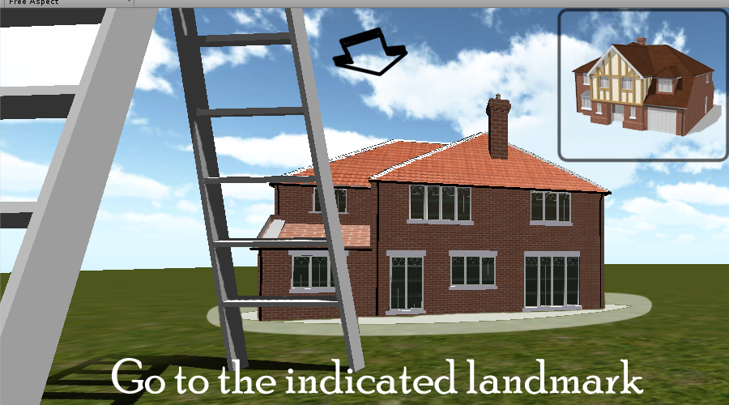

Fleshed out use case for the guided prompts idea (First stage).

At the start of the game the user will be given a quick tutorial. After the tutorial the user will be given full control of their movements and are allowed to roam.

**Landmark description**

Option 1
* A picture of the area or a picture of the indicated landmark is shown at the corner of the screen or is shown for a brief amount of time. The user will have to make their way to these landmarks and a new one will pop up in the same place after they reach it. When the user has traversed through all the required landmarks they have cleared the requirements for finishing the stage.

Option 2
* A short description of the landmark (i.e "A big rock with a face on the side") is written and the user must go to the landmark of this description. Once they reach this landmark, another description is written on that landmark and they get a new destination. The last landmark will simply say congratulations and the user will be allowed to finish the stage.

An arrow is shown at the middle top of the screen and guides the user to the landmark. The arrow points in the general direction of the way to go and will rotate as the user faces in a different direction. The arrow will point towards the screen (straight ahead) if the player is facing the indicated landmark.

**Time limit**

Option 1
* There is a time limit for each landmark and the user must navigate to the indicated landmarks as quickly as possible. They will be given a new time limit when they are given a new landmark to navigate to. The time it took to get to these landmarks will be stamped on the upper right hand side of the screen like a list. This is to make it seem more like a race and with a visual feedback (the time stamped on the side) this will encourage the player to try to be as fast as possible.

Option 2
* There is an overall time limit and the user must navigate through all the landmarks as quickly as possible. Unlike the first option, there is no timestamp and the player can explore the area within the time limit given. This is to guide the player to the end without making it seem like we're rushing them too much. The player won't feel and initiative to head to the exit when there's nothing pushing them so the time limit is to put a slight restraint on their time to roam and explore. This way the test will not give them an infinite amount of time. 

The last indicated direction should be the exit. When the user hits the exit they will be brought to the 2nd stage.

Example:
