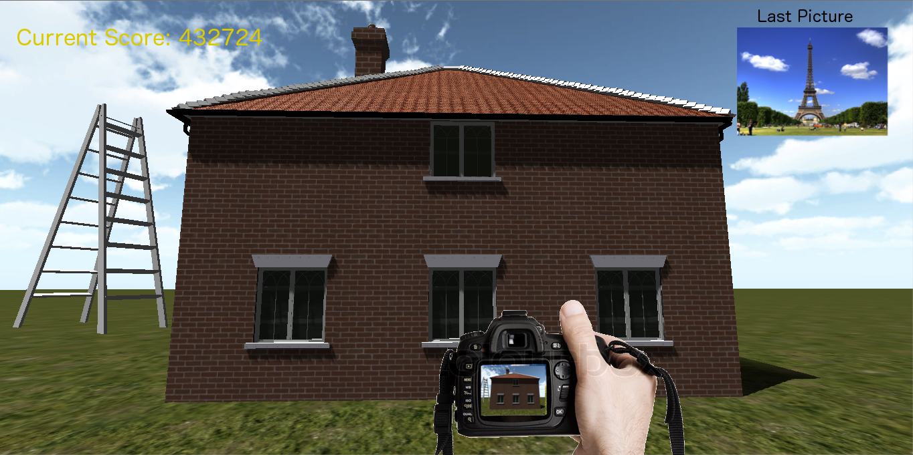
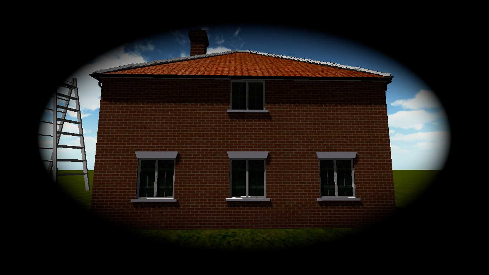

## The Game: _Snap Shot_

This is the use case for the 1st Stage idea, Snap Shot(Pokemon Snap knockoff).

After the user is finished with [the tutorial](./Testee-Use-Case:-Tutorial:-Stage-1#pokemon-snap) and given control to look around. The player will be guided along through the environments on a moving machine.

##Gameplay
While moving moved through the environment, the player could be tasked with doing one of more of the following in order to earn points!:
* The player will be told to take photos of specific landmarks or objects. 
    * The closer the object is towards the center of the picture the more points the player is given. 
    * closeness to a ratio of object/picture(how much of the picture is filled by the object) affects how many points are earned.
* The player is tasked with hitting targets or knocking down certain objects. This gives them points!!
* There are targets shown around the room and player is given the ability to throw an object (i.e. ball). When the ball hits the target, the player will receive points depending on how close the ball was towards the center of the target. 

### Player View and Controls
In this first part of the game, the player is in first person view and sees themselves holding a camera at the bottom of the screen. They can rotate in any direction but cannot move(they are _on rails_).

Before taking a picture the player must raise the camera and look through the lens by hitting a button. 

When viewing through the camera lens, they see a cross-hair and their field of view is restricted and zoomed. 

The player can control the level of zoom while using the camera.

When a picture is taken, the screen flashes and the screen freezes for a moment. 

Then the picture the player took flys off the the upper left corner where it is displayed with the points earned for it

The Player also sees a running total of the points on their screen.

### UI

The player must bring the camera up in order to take a picture!

##Stage 2: Testing the Player

In this stage, the player is still in first person, but is missing their camera. They can now move around freely. These controls are presented to the player with [tutorial prompts](./Testee-Use-Case:-Tutorial:-Stage-2#pokemon-snap).

The player is put in a room with a projector and the projector shows the picture that they took in the first stage. The player can then step through the picture to interact with the environment. The player is restricted to the area around the shown environment. The environment has been changed by the tester and the player must pick out what has been modified.
There will be multiple pictures and the player must fix each one. 